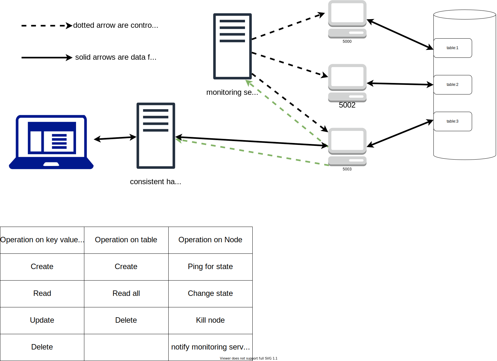

# Distributed Key Value Store

<!-- logo -->
<p align="center">
    
</p>

<!-- table of contents -->

-   [Description](#Description)
    -   [Built With](#Built-With)
-   [Installation](#Installation)
    -   [Dependencies](#Dependencies)
    -   [How to start](#How-to-start)
-   [Usage](#usage)
    -   [Key value pair routes](#Key-value-pair-routes)
    -   [Node creation/deletion routes](#Node-creation/deletion-routes)
-   [Structure](#Structure)
    -   [File structure](#File-structure)

## Description

This is the HTTP server node that will interact with redis database. A group of replicas will form the distributed key value store.

### Built With

| Part     | Technology |
| -------- | :--------: |
| Server   |    Gin     |
| database |   redis    |

## Installation

### Dependencies

First you need redis to be installed on your local machine

Windows choco:

```shell
choco install redis-64
```

Mac brew:

```shell
brew install --cask redis
```

Debian/Ubuntu:

```shell
sudo apt-get install redis -y
```

### How to start

Start service individually on port **5000**

```shell
make dev
```

> Other commands are in `makefile`

## Usage

> :exclamation: Make sure you have redis service running.

### Key value pair routes

```
http://<your instance ip>:<port>/key-value-pair
```

| Request  |                  Location                   |                             Description |
| -------- | :-----------------------------------------: | --------------------------------------: |
| `GET`    | /key-value-pair?node=`nodeId`&key=`keyname` |     get one key value pair with keyname |
| `POST`   |               /key-value-pair               |           create one new key value pair |
| `PUT`    |               /key-value-pair               |               update one key value pair |
| `DELETE` | /key-value-pair?node=`nodeId`&key=`keyname` | delete one key value pair with key name |

### Node creation/deletion routes

```
http://<your instance ip>:<port>/node
```

| Request  |           Location            |                  Description |
| -------- | :---------------------------: | ---------------------------: |
| `POST`   |             /node             |          create one new node |
| `DELETE` | /key-value-pair?node=`nodeId` | delete one node with node id |

> Note: There are some sample API calls in `resquests.rest`

## Structure

### File structure

```shell
.
├── config # configuration files
│   └── Redis.go # redis config
├── controllers # handlers
│   ├── databaseIO.go # key value pair handlers
│   └── serverOperation.go # node handlers
├── databases # database operations
│   ├── redisIO.go # key value pair I/O
│   └── redisNode.go # node creation & deletion
├── docs # documentation & supporting resources
│   └── resources
│       └── logo.svg
├── routers # routes
│   ├── databaseIO.go # key value pair routes
│   └── serverOperation.go # node routes
├── tools # external dependencies
│   └── redisClient.go # redis connection client
├── utils # utilities
│    └── PrintArrayInterface.go # print array interface items in console
├── go.mod
├── go.sum
├── main.go # entry point
└── request.rest # sample API calls
```

### System structure


